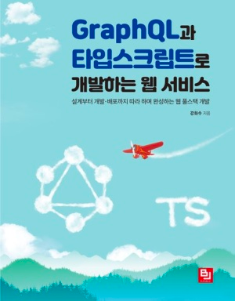

### ⚠️ 소스 코드 관련 주의 사항(Precautions for Source Code)

---
주니의 블로그에 설명과 함께 실습하고, 사용해볼 수 있도록 만든 코드 입니다.
본 코드를 내려 받고 바로 실행 시키면 따른 설정 없이 바로 실습해 볼 수 있습니다.

다만, 아래 사항을 반드시 지켜주시기 바랍니다.

첫째: 실습을 위해 소스 코드를 내려 받기 전 ⭐️ (Star)를 한번만 꾹 눌러주세요.
둘째: 반드시 자신의 Git Hub Repository (레포지터리)에 Fork 한 뒤 그 곳에서 내려 받아 이용해 주세요. 
셋째: 실습 하면서 발생되는 버그 등에 대해서 수정하시게 되면 많은 사람들과 공유를 위해 [📨 Mail](junyharang8592@gmail.com) 주시면 해당 수정 뒤 PR 보낼 수 있는 Branch를 열어 드리고 알려드리겠습니다.
넷째: 자신의 Git Hub 등에 코드를 공개하시고자 할 경우 본 README.md를 수정, 삭제하지 말아주시기 부탁드립니다! 🙏

공부하시는 데 도움이 되시기 바랍니다 😀

If you download this code and run it right away, you can practice it right away without the settings that you follow.

However, please make sure to follow the following.

First: Press ⭐(Star) once before downloading the source code for practice.
Second: Make sure to fork your Git Hub Repository and download it from there to use it.
Third: If you fix bugs that occur during the practice, please [📨 send me an email](junyharang8592@gmail.com) for sharing with many people, and I will open a branch where you can send PR after the correction and let you know.

I hope it helps you study 😀

# 🚀 실습 소개

각 종 언어와 Framwork를 사용하여 GraphQL 실습 및 공부

  

   

## Project Code 정리

### 🗂 목차

---
●[GraphQL과 Apollo 첫번째 이야기 - 개념 익히기](https://junyharang.tistory.com/509)
 
●[GraphQL과 Apollo 두번째 이야기 - REST API란?](https://junyharang.tistory.com/457)
 
●[GraphQL과 Apollo 세번째 이야기 - GraphQL의 정보 주고 받는 방식](https://junyharang.tistory.com/511)
 
●[GraphQL과 Apollo 네번째 이야기 - Apollo란?](https://junyharang.tistory.com/512)
 
●[GraphQL과 Apollo 다섯번째 이야기 - GraphQL을 간단하게 구현해 보아요 😀](https://junyharang.tistory.com/513)
 
●[GraphQL과 Apollo 여섯번째 이야기 - GraphQL Module화에 대해 알아보아요 😀](https://junyharang.tistory.com/514)
 
●[GraphQL과 Apollo 일곱번째 이야기 - GraphQL Data Type에 대해 알아보아요 😀](https://junyharang.tistory.com/515)
 
●[GraphQL과 Apollo 여덟번째 이야기 - GraphQL Union과 Interface 그리고 인자와 인풋 타입에 대해 알아보아요 😀](https://junyharang.tistory.com/516)
 
●[GraphQL과 Apollo 아홉번째 이야기 - Java + Spring Boot에서 GraphQL 사용해 보기 - 실습 환경 구성](https://junyharang.tistory.com/517)
 
●[GraphQL과 Apollo 열번째 이야기 - Java + Spring Boot에서 GraphQL 사용해 보기 - 실습 해보기](https://junyharang.tistory.com/518)
  

#### 🔊 알려드려요!

   

해당 소스코드 안에는 Graphiql에서 테스트할 수 있는 Scala 문법을 미리 정리해 두었어요.
/src/main/resources/graphql/query 에 위치해 있고, 여기에 있는 문법들을 Graphiql에서 사용하시면 바로바로 테스트 할 수 있어요!

또한, 이 소스코드를 내려 받으시면 추가 설정 없이 바로 실습이 가능합니다!
Embedded H2 DB In Memory Mode로 DB가 구성 되어 있기 때문이에요. 😀

실습을 위해 내려 받으실 때는 본인의 Repository로 Fork를 한 뒤에 내려 받아주세요!
또한, Star를 눌러주시면 정말 많이 힘이 날 거 같아요. 🤭

---
