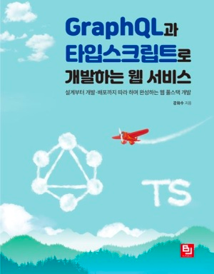

# 🚀 실습 소개

각 종 언어와 Framwork를 사용하여 GraphQL 실습 및 공부

  

   

## Project Code 정리

### 🗂 목차

---
●[GraphQL과 Apollo 첫번째 이야기 - 개념 익히기](https://junyharang.tistory.com/509)
 
●[GraphQL과 Apollo 두번째 이야기 - REST API란?](https://junyharang.tistory.com/457)
 
●[GraphQL과 Apollo 세번째 이야기 - GraphQL의 정보 주고 받는 방식](https://junyharang.tistory.com/511)
 
●[GraphQL과 Apollo 네번째 이야기 - Apollo란?](https://junyharang.tistory.com/512)
 
●[GraphQL과 Apollo 다섯번째 이야기 - GraphQL을 간단하게 구현해 보아요 😀](https://junyharang.tistory.com/513)
 
●[GraphQL과 Apollo 여섯번째 이야기 - GraphQL Module화에 대해 알아보아요 😀](https://junyharang.tistory.com/514)
 
●[GraphQL과 Apollo 일곱번째 이야기 - GraphQL Data Type에 대해 알아보아요 😀](https://junyharang.tistory.com/515)
 
●[GraphQL과 Apollo 여덟번째 이야기 - GraphQL Union과 Interface 그리고 인자와 인풋 타입에 대해 알아보아요 😀](https://junyharang.tistory.com/516)
 
●[GraphQL과 Apollo 아홉번째 이야기 - Java + Spring Boot에서 GraphQL 사용해 보기](https://junyharang.tistory.com/517)
  

#### 🔊 알려드려요!

   

해당 소스코드 안에는 Graphiql에서 테스트할 수 있는 Scala 문법을 미리 정리해 두었어요.
/src/main/resources/graphql/query 에 위치해 있고, 여기에 있는 문법들을 Graphiql에서 사용하시면 바로바로 테스트 할 수 있어요!

또한, 이 소스코드를 내려 받으시면 추가 설정 없이 바로 실습이 가능합니다!
Embedded H2 DB In Memory Mode로 DB가 구성 되어 있기 때문이에요. 😀

실습을 위해 내려 받으실 때는 본인의 Repository로 Fork를 한 뒤에 내려 받아주세요!
또한, Star를 눌러주시면 정말 많이 힘이 날 거 같아요. 🤭

---