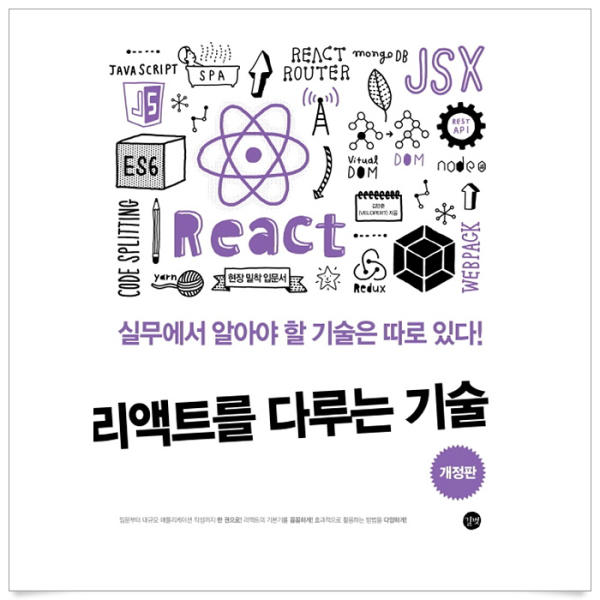
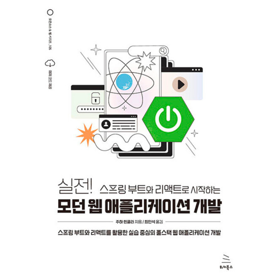

### ⚠️ 소스 코드 관련 주의 사항(Precautions for Source Code)

---
본 코드는 TypeScript + Nest.js 그리고, TypeORM, Query Builder를 이용하여 Apollo 그리고, React.js를 이용한 GraphQL에 대해 이용하는 방법을 주니의 블로그에 설명과 함께 실습하고, 사용해볼 수 있도록 만든 코드 입니다.
본 코드를 내려 받고 바로 [실습 서버 구동 방법](#-실습-서버-구동-방법) 방법대로 명령어를 입력하여 실행 시키면 따른 설정 없이 바로 실습해 볼 수 있습니다. <br>

다만, 아래 사항을 반드시 지켜주시기 바랍니다. <br>

첫째: 실습을 위해 소스 코드를 내려 받기 전 ⭐️ (Star)를 한번만 꾹 눌러주세요. <br>
둘째: 반드시 자신의 Git Hub Repository (레포지터리)에 Fork 한 뒤 그 곳에서 내려 받아 이용해 주세요. <br>
셋째: 실습 하면서 발생되는 버그 등에 대해서 수정하시게 되면 많은 사람들과 공유를 위해 [📨 Mail](junyharang8592@gmail.com) 주시면 해당 수정 뒤 PR 보낼 수 있는 Branch를 열어 드리고 알려드리겠습니다. <br>
넷째: 자신의 Git Hub 등에 코드를 공개하시고자 할 경우 본 `README.md`를 수정, 삭제하지 말아주시기 부탁드립니다! 🙏 <br>

공부하시는 데 도움이 되시기 바랍니다 😀 <br>

This code is made so that you can practice and use TypeScript + Nest.js, React.js
and how to use GraphQL using Apollo using TypeORM, Query Builder with explanation on Juny's blog.
If you download this code and [enter and execute the command](#-실습-서버-구동-방법) as soon as you run the training server,
you can practice it right away without the settings that you follow.

However, please make sure to follow the following.

First: Press ⭐ ️ once before downloading the source code for practice. <br>

Second: Make sure to fork your Git Hub Repository and download it from there to use it. <br>

Third: If you fix bugs that occur during the practice, please [📨 send me an email](junyharang8592@gmail.com) to share with many people,
and I will open a branch where you can send PR after the correction and let you know. <br>

Fourth: If you want to publish your code on your Git Hub, etc., please don't edit and delete this `README.md` ! 🙏<br>

I hope it helps you study 😀 <br>
<br><br>

# 🚀 실습 소개

각 종 언어와 Framwork를 사용하여 GraphQL 실습 및 공부

<br><br>

[](https://link.coupang.com/a/bglCvF) <br><br>

### 🎬 실습 서버 구동 방법

```bash
npm start
```

위 명령어만 입력해 주시면 됩니다.<br>
Just you write this command in the command line.

<br><br>

[](https://www.coupang.com/vp/products/297473745?itemId=937125075&src=1139000&spec=10799999&addtag=400&ctag=297473745&lptag=AF2671443&itime=20231209025222&pageType=PRODUCT&pageValue=297473745&wPcid=16967842423750573774767&wRef=&wTime=20231209025222&redirect=landing&traceid=V0-101-cf3821fea480193c&mcid=8d56e107b2af4b43ae6dccd936ee4f39&placementid=&clickBeacon=&campaignid=&contentcategory=&imgsize=&tsource=&pageid=&deviceid=&token=&contenttype=&subid=&impressionid=&campaigntype=&requestid=&contentkeyword=&subparam=&isAddedCart=) 
<br><br>

## Project Code 정리

### 🗂 목차


---
✅ [GraphQL과 Apollo 첫번째 이야기 - 개념 익히기](https://junyharang.tistory.com/509)
<br><br>
✅ [GraphQL과 Apollo 두번째 이야기 - REST API란?](https://junyharang.tistory.com/457)
<br><br>
✅ [GraphQL과 Apollo 세번째 이야기 - GraphQL의 정보 주고 받는 방식](https://junyharang.tistory.com/511)
<br><br>
✅ [GraphQL과 Apollo 네번째 이야기 - Apollo란?](https://junyharang.tistory.com/512)
<br><br>
✅ [GraphQL과 Apollo 다섯번째 이야기 - GraphQL을 간단하게 구현해 보아요 😀](https://junyharang.tistory.com/513)
<br><br>
✅ [GraphQL과 Apollo 여섯번째 이야기 - GraphQL Module화에 대해 알아보아요 😀](https://junyharang.tistory.com/514)
<br><br>
✅ [GraphQL과 Apollo 일곱번째 이야기 - GraphQL Data Type에 대해 알아보아요 😀](https://junyharang.tistory.com/515)
<br><br>
✅ [GraphQL과 Apollo 여덟번째 이야기 - GraphQL Union과 Interface 그리고 인자와 인풋 타입에 대해 알아보아요 😀](https://junyharang.tistory.com/516)
<br><br>
✅ [GraphQL과 Apollo 아홉번째 이야기 - Java + Spring Boot에서 GraphQL 사용해 보기](https://junyharang.tistory.com/517)
<br><br>
✅ [GraphQL과 Apollo 열번째 이야기 - Java + Spring Boot에서 GraphQL 사용해 보기 - 실습 해보기](https://junyharang.tistory.com/518)
<br><br>
✅ [GraphQL과 Apollo 열 한번째 이야기 - TypeScript + Nest.js에서 GraphQL 사용해 보기 - 실습 환경 구성](https://junyharang.tistory.com/524)
<br><br>
✅ [GraphQL과 Apollo 열 두번째 이야기 - TypeScript + Nest.js에서 GraphQL 사용해 보기 - 실습 환경 테스트](https://junyharang.tistory.com/525)
<br><br>
✅ [GraphQL과 Apollo 열 세번째 이야기 - TypeScript + Nest.js에서 GraphQL 사용해 보기 - 실습 해보기](https://junyharang.tistory.com/527)
<br><br>
✅ [GraphQL과 Apollo 열 네번째 이야기 - React와 Apollo Client](https://junyharang.tistory.com/528)
<br><br>
✅ [GraphQL과 Apollo 열 다섯번째 이야기 - React와 Apollo Client - Query와 Mutation 사용하여 웹 페이지 만들기](https://junyharang.tistory.com/529)
<br><br>
✅ [GraphQL과 Apollo 열 여섯번째 이야기 - Kotlin + Spring Boot에서 GraphQL 사용해 보기 - 실습 환경 구성](https://junyharang.tistory.com/533)
<br><br>
✅ [GraphQL과 Apollo 열 일곱번째 이야기 - Kotlin + Spring Boot에서 GraphQL 사용해 보기 - 실습 해보기](https://junyharang.tistory.com/534)
<br><br><br>

#### 🤔 내가 만난 문제
⚠️ [\[Nest.js\] TypeORM Table 관계가 맺어졌을 때, Seeding \(feat. Migration\)](https://junyharang.tistory.com/521)
<br><br>
⚠️ [\[Spring Boot 3.0\] Could not resolve org.springframework.boot:spring-boot-gradle-plugin](https://junyharang.tistory.com/532)
<br><br>
⚠️ [\[Spring Boot 3\] Spring Doc(Swagger) White Label Error](https://junyharang.tistory.com/535)
<br><br><br>

#### 📋 부록
🔍 [\[Nest.js\]초기 환경 구성 (feat. TypeORM, QueryBuilder, GraphQL, Apollo)](https://junyharang.tistory.com/520)
<br><br>
🔍 [\[SOLID\]\[Nest.js\]\[Java + Spring\] Interface를 활용한 결합도 분리 \(Interface를 이용한 Dependency Injection - DI\)](https://junyharang.tistory.com/526)
<br><br><br>

#### 🔊 알려드려요!
 
--- 

실습을 위해 내려 받으실 때는 본인의 Repository로 Fork를 한 뒤에 내려 받아주세요!
또한, Star를 눌러주시면 정말 많이 힘이 날 거 같아요. 🤭
<br><br>

[](https://www.coupang.com/vp/products/7281226704?itemId=18590253396&src=1139000&spec=10799999&addtag=400&ctag=7281226704&lptag=AF2671443&itime=20231209024953&pageType=PRODUCT&pageValue=7281226704&wPcid=16967842423750573774767&wRef=&wTime=20231209024953&redirect=landing&traceid=V0-101-fffde93854a30e4a&mcid=27a860e7667148fda6f76e9f79ca541f&placementid=&clickBeacon=&campaignid=&contentcategory=&imgsize=&tsource=&pageid=&deviceid=&token=&contenttype=&subid=&impressionid=&campaigntype=&requestid=&contentkeyword=&subparam=&isAddedCart=)
